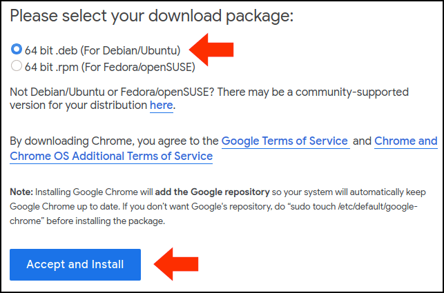
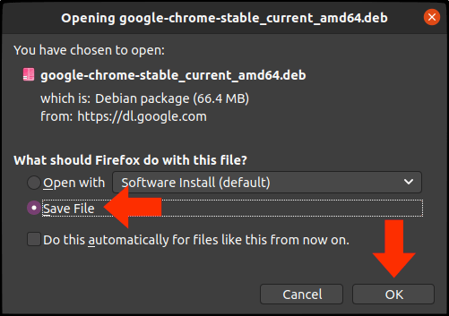

# Chrome

The Chrome web browser for Linux.

## Installation

1. The FireFox browser comes with Ubuntu. Using FireFox from within the Ubuntu VM, visit: [https://www.google.com/chrome/](https://www.google.com/chrome/)<br><br>
2. Click the `Download Chrome` button and select the version for *64 bit .deb (For Debian/Ubuntu)*; then click on `Accept and Install`.<br><br>
<br><br>
<br><br>
3. When the dialog box comes up, choose to Save the file (rather than open it). This will place the Chrome installer in your `Downloads` folder.<br><br>
<br><br>
4. Now install Chrome with these commands:

```
cd ~/Downloads
sudo apt install ./google-chrome-stable_current_amd64.deb
rm google-chrome-stable_current_amd64.deb
```

## Usage

Enter:

```
google-chrome-stable &
```

then pin the icon to your favorites.

## Additional Help

[http://google.com/chrome](http://google.com/chrome)

---
*Last update: 08/03/20*
