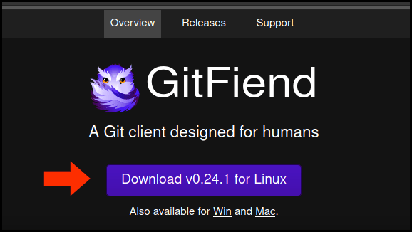
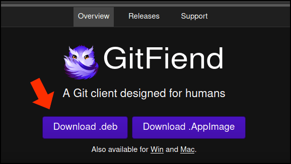
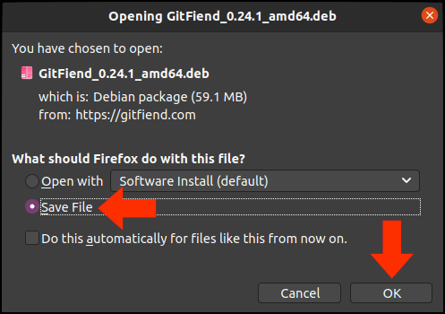

# GitFiend

Gitfiend is a nice visual Git Client for Linux.

## Installation

## Step 1:

Visit [https://gitfiend.com](https://gitfiend.com) using the browser *from inside* your VM. Once there, click on the download button for Linux. If the button says Windows or Mac, you may not be using the browser *from inside* your VM.



## Step 2: 

In the next window, click on `Download .deb` 



## Step 3:

You'll see the window below, asking you what to do with the file. Note that this window reflects using the Firefox browser. If you're using Chrome inside your VM, it will look slightly different. Just ensure that you choose to save the file, rather than opening it.

When you're ready, click `OK`.



## Step 4:

The default save location in FireFox is your `Downloads` directory. If you saved the file somewhere else, modify the commands below to change to that directory. Also, in the commands below replace the version number (in this case `0.24.1`) with whatever version of GitFiend you downloaded.

When you're ready, enter these commands (enter your password if prompted):

```Shell
cd ~/Downloads
sudo apt install ./GitFiend_0.24.1_amd64.deb
rm -f GitFiend_0.24.1_amd64.deb
```

## Usage

Enter:

```Shell
gitfiend &
```

then pin the icon to your favorites.

## Additional Help

[https://gitfiend.com/](https://gitfiend.com/)

---
*Last update: 07/11/20*
