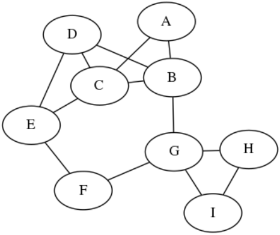

# graphviz

The graphviz module is a suite of tools (called *filters*) in Linux for visualizing graphs described in plaintext  `dot` files. For example, this `dot` file:

```
graph G {
  A -- B;
  A -- C;
  B -- C;
  B -- D;
  B -- G;
  C -- D;
  C -- E;
  D -- E;
  E -- F;
  F -- G;
  G -- H;
  G -- I;
  H -- I;
}
```

Renders like this when using a `graphviz` filter:



## Installation

```
sudo apt install graphviz  
```

## Usage

You don't call graphviz directly. Instead, you call the *filters* that are part of the graphviz suite. There are two commonly-used filters:

- `fdp`: *Force Directed Placement*, which renders nice pictures for undirected graphs
- `dot`: For directed graphs

Common syntax:

```
fdp <input file> -T <output file format> -o <output file>
```

Example:

```
fdp example.dot -T png -o example.png
```

## Additional Help

```
man dot 
```
---
*Last update: 02/04/20*
Linux