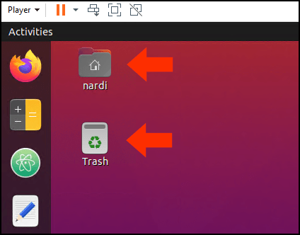

# Hiding Home and Trash Icons in Ubuntu

When you first start Ubuntu Linux, you may see both *Home* and *Trash* icons on your desktop, like in the picture below. They're not desktop shortcuts in the traditional sense, so you can't just delete them. However, if you'd prefer to have either of those icons hidden you can achieve that with a few shell commands.



## Implementation

```Shell
# To hide the home icon:
gsettings set org.gnome.shell.extensions.desktop-icons show-home false

# To hide the trash icon:
gsettings set org.gnome.shell.extensions.desktop-icons show-trash false

# To display the icons again, change 'false' to 'true' in the commands above
```

## Usage

```Shell
N/A
```

## Additional Help

[How do I remove home folder from the desktop?](https://askubuntu.com/questions/479546/how-do-i-remove-home-folder-from-the-desktop)

---
*Last update: 07/28/20*
