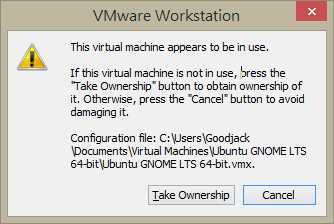

# Fixing The *"This virtual machine appears to be in use"* Issue.

## The Issue

At some point, when you try to start your VM, you may see an error like this:



## The Fix

* Shut down any running virtual machines.
* Close the VMware Workstation Player Software.
* Using the file browser in Windows, navigate to the directory that contains your VM. It should be something like this:

```Shell
C:\Users\<your Windows username>\Documents\Virtual Machines\<your VM name>
```

* Delete any file or folder that ends with `.lck` or `.lock`.
* Restart VMware Workstation Player.
* Restart your VM.

*Last update: 07/27/20*
