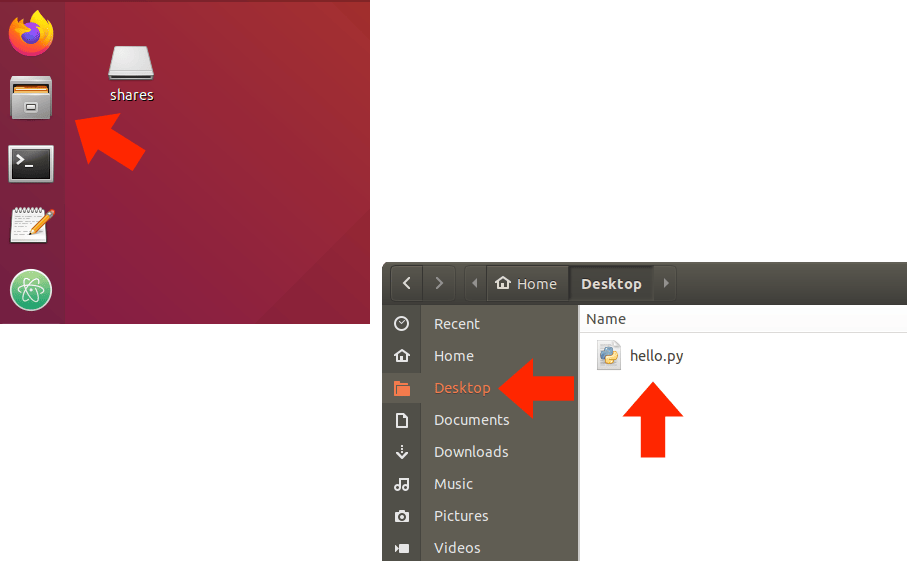
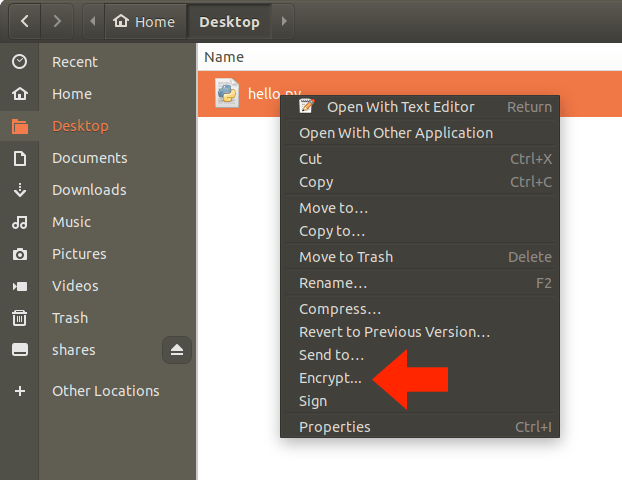
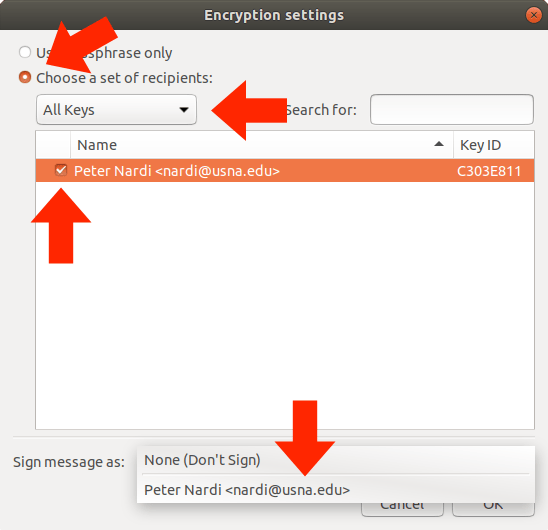
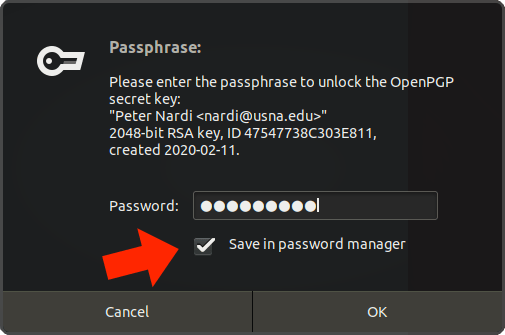
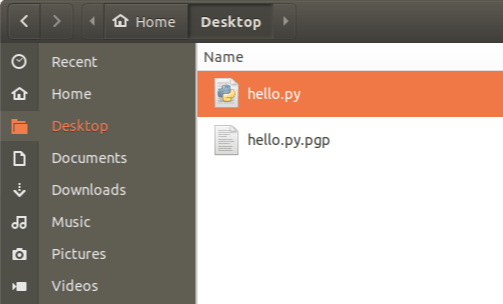
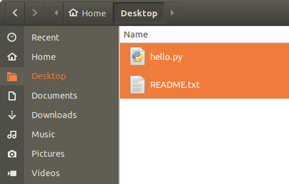
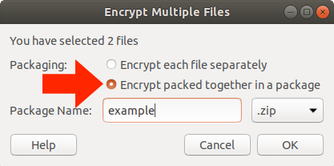
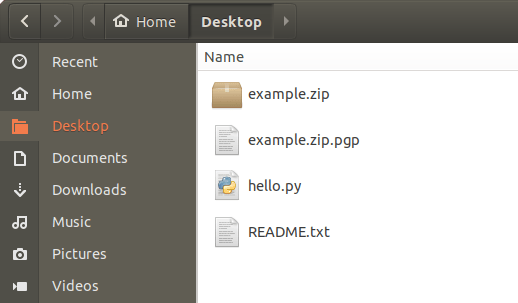
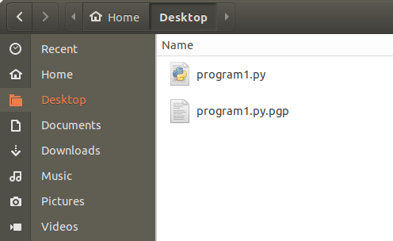

# Encrypting and Decrypting Files in Ubuntu Linux

These instructions will guide you through the process for encrypting and decrypting files using public / private keys in Ubuntu.  Before you begin, ensure you've completed the setup instructions found here:

[Part-4: Setup Instructions for Public Key Encryption in Ubuntu Linux](../setupguides/vmguide-p4.md)

## Encrypting A Single File

### Step - 1: 

Select the file to encrypt using Ubuntu's file manager.  In the example below, I opened the file manager and selected a file on the `Desktop` called `hello.py`.

### Step - 2:

Right click on the file you want to encrypt and select `Encrypt...`

 
### Step - 3:

When the encryption settings window appears:

1. Select `Choose a set of recipients:`
2. If necessary, make sure that `All Keys` is selected.
3. Select the user you want to send the file to.
4. Select the dropdown menu next to `Sign message as:` and chose your own name.

*Note: You can select more than one recipient when you encrypt a file.  Just remember, if anyone gets the file who is not a chosen recipient they will not be able to access the file's contents.  That's whole point of encryption :-)*

### Step - 4:

The first time you encrypt a file, you should see the dialog below.  Enter the password you used when you created your encryption keys (*it was probably the same password that you used for your VM*).  If you then check the box that says `Save in password manager` before you click on `OK`, you won't have to type your password again when you encrypt files in the future.

### Step - 5:

That's it! Your encrypted file will have the same name as the original, but with a `.pgp` extension.  You can now safely post the encrypted file on public sites and only the intended recipients will be able to access its contents.

## Encrypting Multiple Files

### Step - 1:

Select all the files you want to encrypt.  In the example below, I held the shift key and clicked on `hello.py` and `README.txt` to select them both.

### Step - 2:

As with a single file, right-click on your selection and choose `Encrypt...`.  After you select the recipients you should see the dialog below.

1. Select `Encrypt packed together in a package`
2. Give your package a unique name (leaving the `.zip` extension as-is).
3. Click `OK`.

### Step - 3:

When the encryption is complete, you'll see the files show below (from our example).  The file `example.zip` is an interim product and can be trashed (***NOTE! As an interim product, `example.zip` is not encrypted.  Anyone who has access to the file will be able to access its contents.***)

The file `example.zip.pgp` is your encrypted content and can be safely shared on a public site.

## Decrypting Files

To decrypt a file, just double-click on it in Ubuntu's file manager.  Encrypted files have a `.pgp` extension.  In the example below, I double-clicked on the file named `program1.py.pgp` and it produced the file `program1.py`.

## Additional Help

[How to easily encrypt/decrypt a file in Linux with gpg](https://www.techrepublic.com/article/how-to-easily-encryptdecrypt-a-file-in-linux-with-gpg/)

[How to enable the encrypt/decrypt menu option in the Ubuntu file manager](https://www.techrepublic.com/article/how-to-enable-encryptdecrypt-menu-option-in-the-ubuntu-file-manager/)

---
*Last update: 02/11/20*
