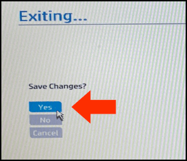

# Part-0: Adjusting the BIOS Settings on Your HP Laptop to Enable Virtualization

Notes:

1. These bios instructions apply to the *HP EliteBook* family of  laptops.

2. Please read and follow these instructions carefully. They're short, so it's recommended that you read them once through, in their entirety, then run through them again to perform the required steps.

3.  It may be easier to bring these instruction up on your phone or another device, since you will not be able to use your computer while you adjust the BIOS.

4.  [Click here](https://www.howtogeek.com/179789/htg-explains-what-is-bios-and-when-should-i-use-it/) to learn more about BIOS: 

---

## Step - 1:

Quit all running programs on your computer, saving your work, if necessary.

## Step - 2:

Restart your computer and watch the screen carefully. As soon as it goes blank, press and hold the <kbd>F10</kbd> key (on the top row of keys). When you see the HP logo shown below, release the <kbd>F10</kbd> key.

If your computer presents you with the Windows login screen, don't worry, just start over from step 2. The timing on pressing the <kbd>F10</kbd> key can be tricky sometimes.
 

## Step - 3:

If you're successful, the screen should briefly go blank; then the logo will appear again; then you should see the BIOS setup screen shown below. Once you're there, click on `Advanced`, then `System Options`.

## Step - 4:

In the next window, ensure that `Virtualization Technology (VTx)` and `Virtualization Technology for Directed I/O (VTd)` are both checked. Leave all other settings alone.

## Step - 5:

Click the `Exit` button on the lower right part of the screen. The `Exit` button will highlight when you move your mouse over it.

## Step - 6:

Click `Yes` when asked if you want to save your changes. 

## Step - 7:

Your computer should restart normally. You're now ready to proceed to:

[Part-1: Installing Workstation Player and Downloading the Ubuntu VM Image](vmguide-p1.md)