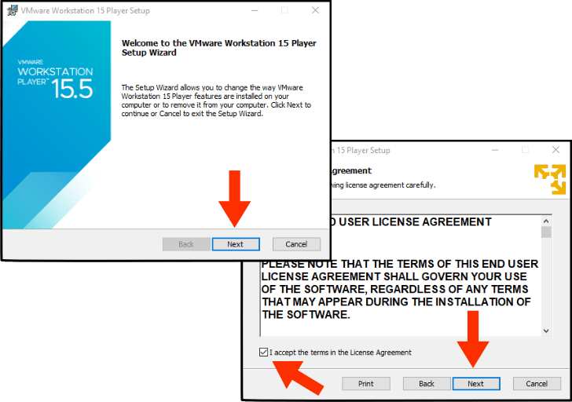
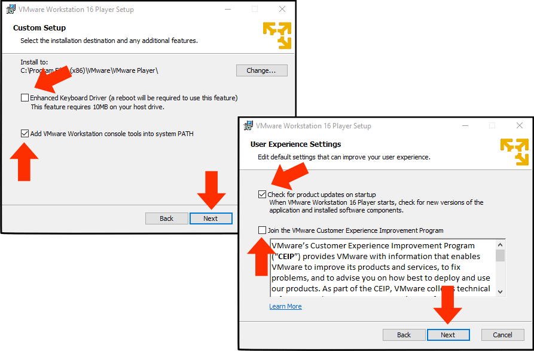
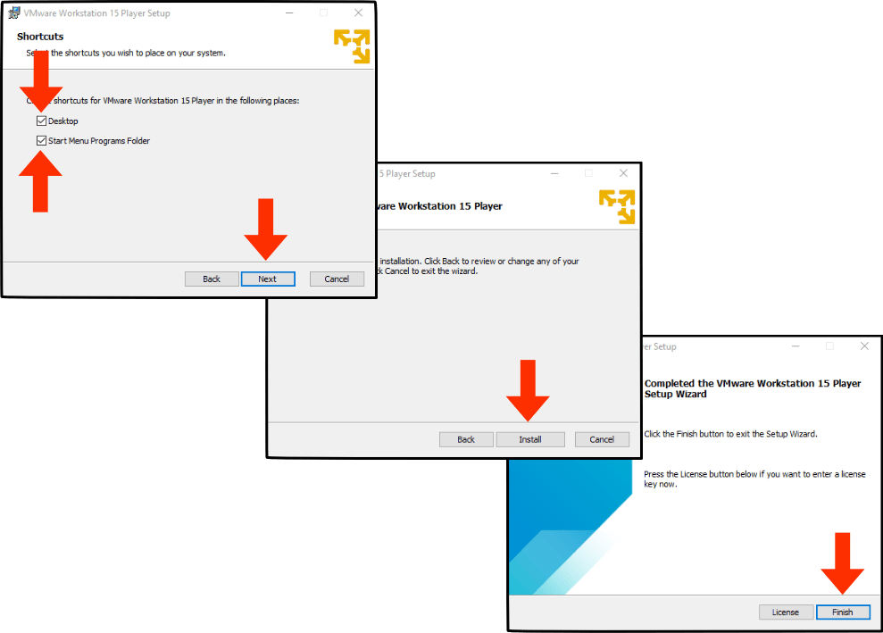
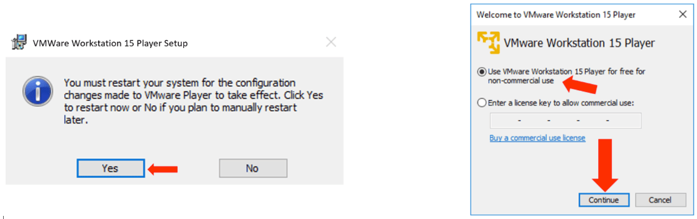
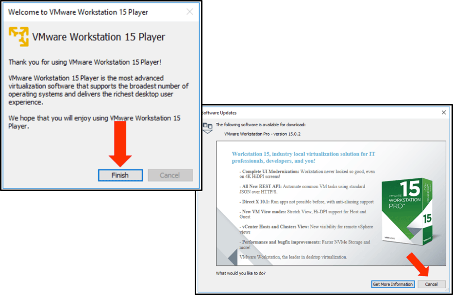
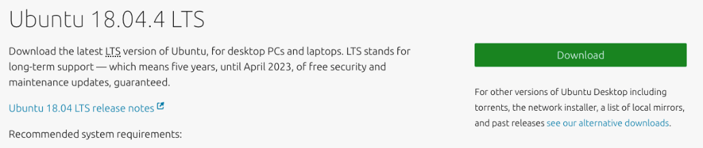
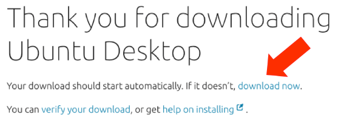

# Part-1: Installing Workstation Player and Downloading the Ubuntu VM Image

Notes: Please read carefully before proceeding.

1. Installation of the VMware Workstation Player will likely require you to restart your computer. Take time now to close any open programs and / or logout of any websites.

2. Some of the graphics in this setup guide might show version numbers that differ slightly from what you see on screen. For example: a graphic in this handout might show version 15.5.1, but when you download the software it will actually be version 15.5.2. This is normal and will have no impact on the installation of your virtual machine.

3. You will be asked to type a series of commands in your virtual machine. All commands are case-sensitive. That means uppercase is different than lowercase. For example: ***ThisIsACommand*** is different than ***thisisacommand***.

---

## Step - 1:

Visit [https://www.vmware.com/products/workstation-player/workstation-player-evaluation.html](https://www.vmware.com/products/workstation-player/workstation-player-evaluation.html) to download the free VMware Workstation Player software.

## Step - 2:

When you get to the site, click on the *`Download Now`* link for the Windows version.

## Step - 3:

Save the installer to a location of your choosing. When the download is complete, double-click on the *`VMware-Player`* executable to begin installation.

## Step - 4:

If Windows prompts you with: *`Do you want to allow this app to make changes to your device?`* Click *`Yes`*.

## Step - 5:

Click *`Next`* on the *`Welcome to the VMWorkstation 15 Player Setup Wizard`* screen.

## Step - 6:

Check the checkbox next to *`I accept the terms in the License Agreement`* and click *`Next`*

## Step - 7:
Make sure the *`Enhanced Keyboard Driver`* option is unchecked, then accept the default *`Install to:`* location by clicking *`Next`*.

## Step - 8:

When you get to the *`User Experience Settings`* screen, make sure *`Check for product updates on startup`* is checked; and *`Join the VMWare Customer Experience Improvement Program`* is unchecked. When complete, click *`Next`*.

## Step - 9:

When you get to the *`Shortcuts`* screen leave both *`Desktop`* and *`Start Menu Programs folder`* checked and click *`Next`*

## Step - 10:

Click *`Install`* to install VMware Workstation Player. Once installation is complete click *`Finish`*.

## Step - 11:

Once the Installation Wizard finishes, you may see a notification (like the one below, left) that you need to restart your system to complete the installation. If you see this, click *`Yes`* to restart your computer.

## Step - 12:

The first time you run VMware Workstation Player you may be asked to choose a licensing option (like the one below, right). Select the radio button next to *`Use VMware Workstation 15 Player for free for non-commercial use`*, then click continue.

## Step - 13:

You may see the window shown below (left). If so, click on *`Finish`*. If you then see the window shown below (right) click on *`Cancel`* or alternatively you may see a window indicating that a Pro Version is available for download. If so, click *`Cancel`*.

## Step 14:

If you are presented with a *`Welcome To Workstation 15 Player`* window you have successfully installed VMware Workstation Player.

## Step 15:

At this point you should have the VMware Workstation Player software installed. If not, please return to step 1.

If you haven’t already done so, download the Ubuntu Linux image file by visiting this link: [https://www.ubuntu.com/download/desktop](https://www.ubuntu.com/download/desktop). Once there, click on the *`Download`* button.

## Step - 16:

Your download should begin automatically and you will be given the option of where to save the Ubuntu iso file. Save the iso file to a location of your choosing, but remember where you put it (I recommend accepting the default location, which is your windows *`Downloads`* folder). If the download doesn’t start in a few seconds click on the *`download now`* link.

## Step - 17:

You're now ready to proceed to:

[Part-2: Installation and Setup of The Ubuntu Virtual Machine](vmguide-p2.md)