# Part-2: Installation and Setup of The Ubuntu Virtual Machine

Notes: Please read carefully before proceeding.

1. Some of the graphics in this setup guide might show version numbers that differ slightly from what you see on screen. For example: a graphic in this handout might show version 15.5.1, but when you download the software it will actually be version 15.5.2. This is normal and will have no impact on the installation of your virtual machine.

2. You will be asked to type a series of commands in your virtual machine. All commands are case-sensitive. That means uppercase is different than lowercase. For example: ***ThisIsACommand*** is different than ***thisisacommand***.

---

## Step - 1:

If you have not completed Part 1 of the installation instructions, please do so before proceeding.

- [Part-1: Installing Workstation Player and Downloading the Ubuntu VM Image](vmguide-p1.md)

## Step - 2:

Start the VMware Workstation Player software. When you get to the startup screen, click on the *`Player`* menu, then select *`File`*, then select *`Preferences…`*
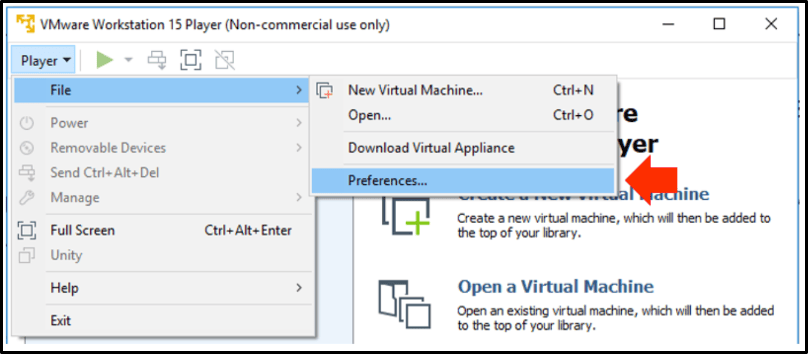

## Step - 3:

Ensure *`Check for product updates on startup`* is checked and *`Check for software components as needed`* is unchecked. Click the *`Okay`* button when ready.

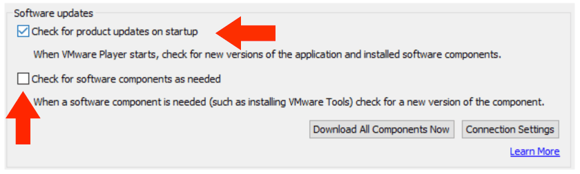

## Step - 4:

When you’re ready to proceed click on *`Create a New Virtual Machine`*.

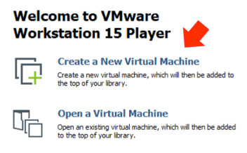

## Step - 5:

You will be greeted by the *`New Virtual Machine Wizard`* shown below. Select the radio button labeled: *`Installer disc image file (iso):`* and click on *`Browse…`*. Navigate to the Ubuntu iso you downloaded from Part-1 and click *`Open`*. Once you’ve selected it you will return to this wizard. Click *`Next >`* to continue.

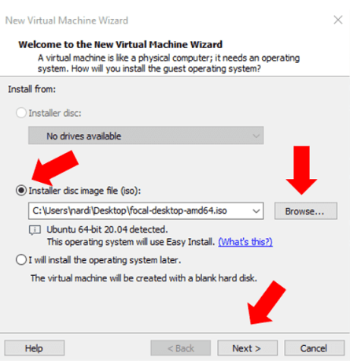

## Step - 6:

Personalize your Ubuntu VM on the next screen. Fill in your *`Full Name`* and use your regular network login as your *`User name`*. Avoid using spaces or special characters in your *`User name`*. Choose any password you wish and click *`Next >`* when you're finished.

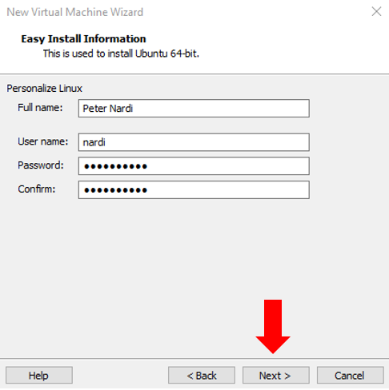

## Step - 7:

Name your virtual machine anything you wish. In this example, I've named my machine *`Totoro`*. Leave the default location as-is and click *`Next >`*

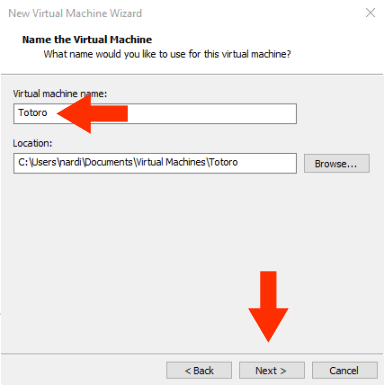

## Step - 8:

Leave the disk capacity set at 20.0 GB. Select the radio button labeled: *`Store virtual disk as a single file`* and click *`Next >`*

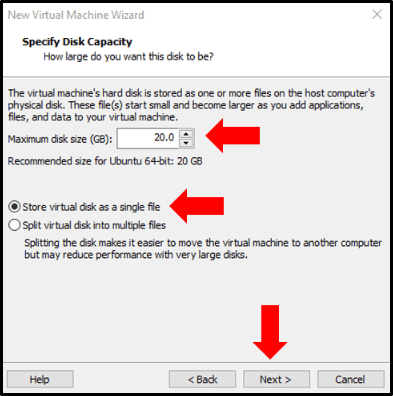

## Step - 9:

On the next screen, click on *`Customize Hardware…`*

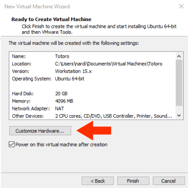

## Step - 10:

Click on the memory option and type: 4096 in the box next to: *`Memory for this virtual machine:`*

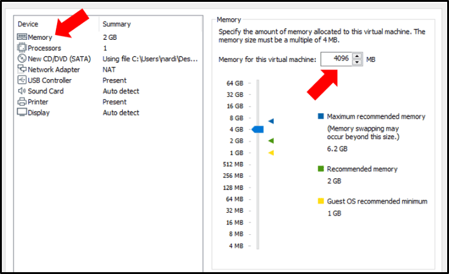

## Step - 11:

Click on the Processors option and select *`2`* from the dropdown menu labeled: *`Number of processor cores:`* Leave all other options as-is and click on *`Close`*, then click on *`Finish`* on the next screen.

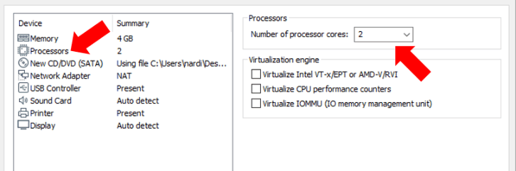

## Step - 12:

If you see the pop-up window below, click on *`Cancel`*

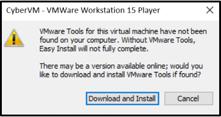

## Step - 13:

You may see the message below during installation. You can safely click the *`X`* to close it.

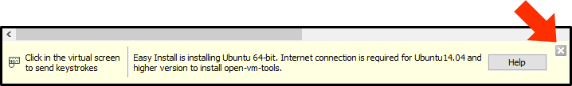

## Step - 14:

Ubuntu will go through the installation process. You may receive a Windows User Account Control (UAC) warning asking if you want to allow changes to your computer.  Allow the VMware software to install at this screen when it asks for your authorization.

## Step - 15:

If everything was successful you’ll be presented with the Ubuntu login screen. Click on your name and enter your password (that you selected earlier) to continue.

## Step - 16:

You should now see a window asking you to connect online accounts. Click on the *`Skip`* button.

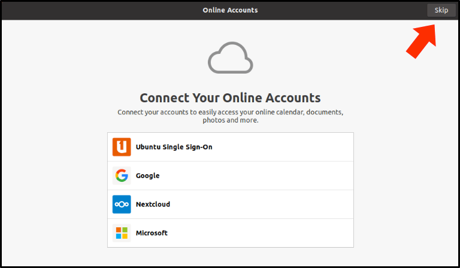

## Step - 17:

You will now see a screen inviting you to set up *Livepatch*. Click the green *`Next`* button once to get to the "*Help Improve Ubuntu*" screen. Once there, select the *`No, don't send system info`* radio button, then click on the green *`Next`* button. 

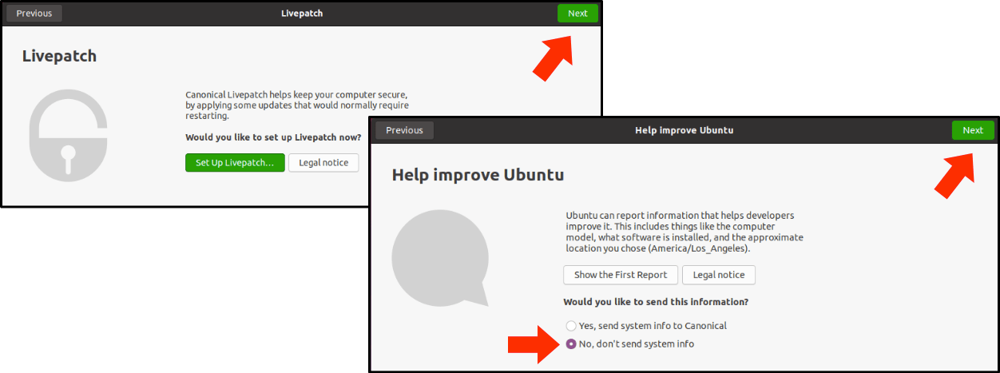

## Step - 18:

At the "*Welcome to Ubuntu*" screen click the green *`Next`* button; then at the "*Ready to go*" screen click the *`Done`* button.

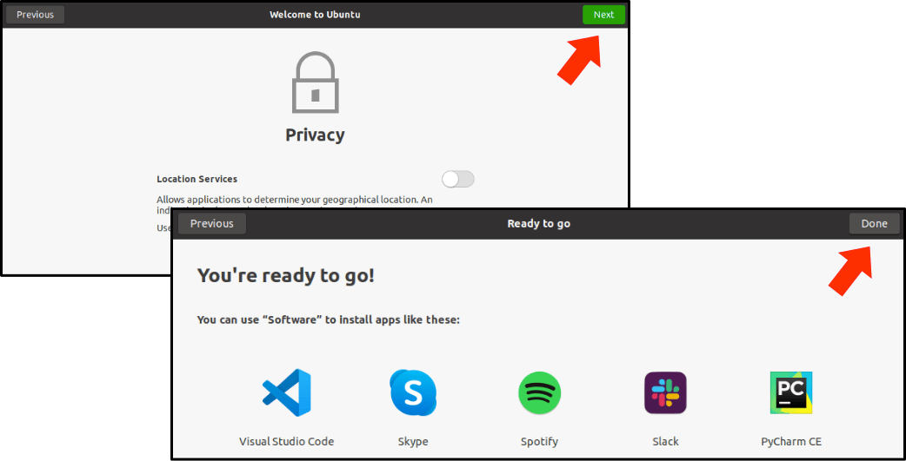

## Step - 19:

You may see a notification window that tells you there are pending updates. If so, click on *`Remind Me Later`*

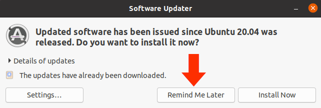

## Step - 20:

Open a new terminal window by right-clicking on the Ubuntu Desktop and selecting *`Open in Terminal`*.

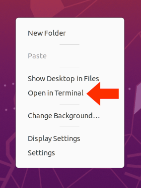

## Step - 21:

Let’s use the Linux Advanced Packaging Tool (*apt*) to complete a thorough update on your VM. Start the update process by entering this command in the terminal window and pressing the enter key (*Note: all commands will be followed by the enter key*):

```Shell
sudo apt update && sudo apt -y upgrade
```

*Note: `update` comes first, then `upgrade`*.

If prompted for your password, enter the password you used when you created your VM (*Note: The characters won’t appear as you type your password, but they are being captured).*

## Step - 22:

You may see the window below as your Ubuntu VM is updating. If so, just press the *`Enter`* key.

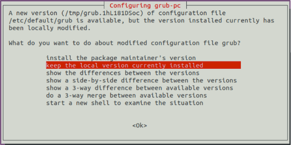

## Step - 23:

When the update is complete (back at your command prompt) install the *`git`* application. The use of *`git`* is discussed in Part 3 of the installation guide. For now, enter the following command in your terminal window:

```Shell
sudo apt -y install git
```

## Step - 24:

When you're back at your command prompt, shutdown the VM by entering the following command in your terminal window:

```Shell
shutdown now
```

## Step - 25:

Congratulations!  You're almost done. You're now ready to proceed to:

 [Part-3: Setup Instructions for Folder Sharing and Repo Cloning](vmguide-p3.md)