# Part-3: Setup Instructions for Folder Sharing and Repo Cloning

## Step - 1:

If you have not completed Parts 1 and 2 of the installation instructions please do so before proceeding.

- [Part-1: Installing Workstation Player and Downloading the Ubuntu VM Image](vmguide-p1.md)
- [Part-2: Installation and Setup of The Ubuntu Virtual Machine](vmguide-p2.md)

## Step - 2:

You can set up a connection between your Host Machine (Windows) and the Linux Virtual Machine running in VMware Player.  This will allow you to not only easily move content from the virtual machine to your Windows machine, but it serves as a great backup strategy if you should ever have an issue with your Ubuntu VM.

## Step - 3:

Start by creating a folder somewhere on your ***Windows Machine*** to hold all your course content. You can put it anywhere you want and call it anything you want; *`Coursework`* is probably a good name and in the screenshot below I’ve put it in my *`Documents`* folder.

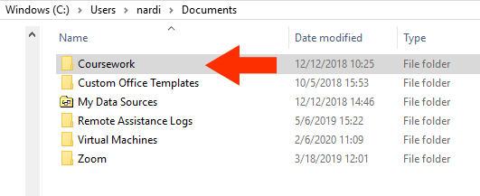

## Step - 4:

Next, open the VMware Player software and click (once) on the VM you created. If your VM is already running, shut it down (don’t just restart); then reopen the VMware Player software and click once on your VM. When you’re ready, click on *`Edit virtual machine settings`* to continue.

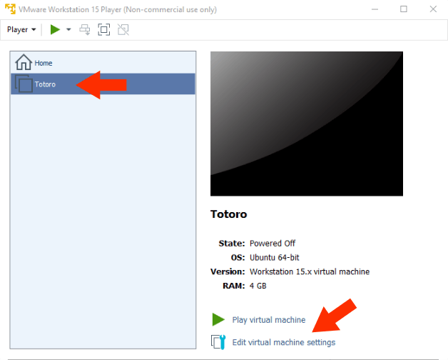

## Step - 5:

Click on the *`Options`* tab, then click on *`Shared Folders`*, select *`Always Enabled`*, then click *`Add…`*

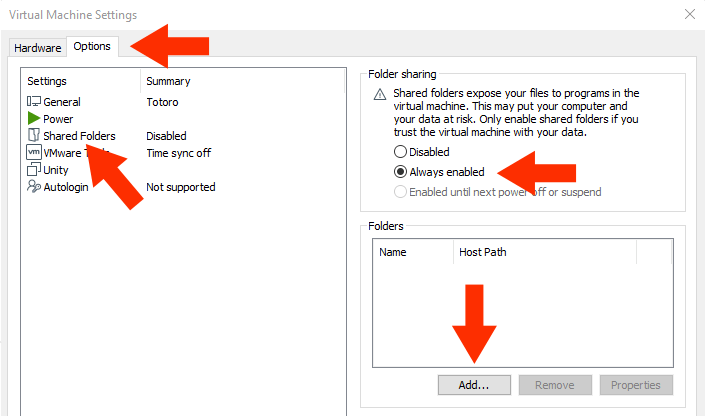

## Step - 6:

You’ll then see the VM *`Add Shared Folder Wizard`*.  Click *`Next >`*.  When prompted for Host path, click *`Browse…`*

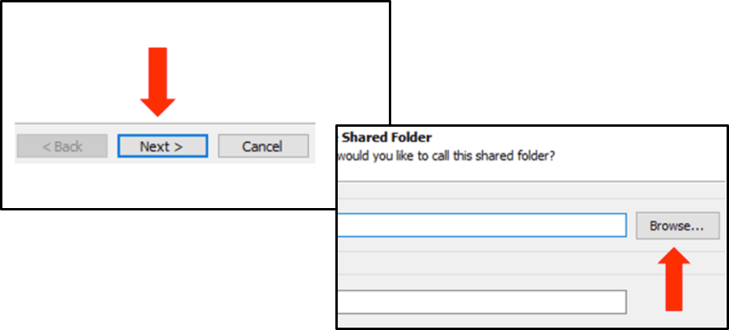

## Step - 7:

Navigate to the folder you created in Windows; select it and click *`OK`*. When you return to the *`Add Shared Folder Wizard`*, click *`Next >`*

***NOTE! Do not select anything in the `Virtual Machines` folder. That’s where your VM lives. In the example below, I navigated to c:\Users\nardi\Documents\Coursework.***

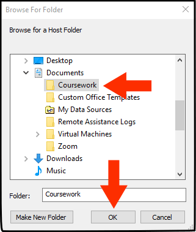

## Step - 8:

In the *`Specify Shared Folder Attributes Window`*, ensure that *`Enable this share`* is checked and *`Read-only`* is unchecked.  Click *`Finish`*. When you return to the Virtual Machine Settings window, click *`OK`*.

***Note: If the `Enable this share` option is grayed-out, your VM is probably running.  If so, shut it down and restart at step 4.***

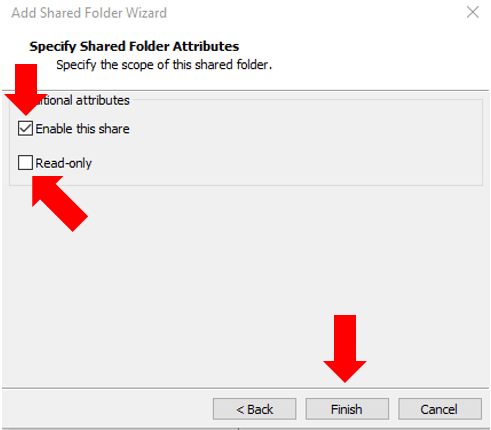

## Step - 9:

Start your virtual machine and login.  If you get the error below about *`SATA Devices`*, click *`No`*.  Once we setup your shared folders that error will disappear the next time you start your VM.

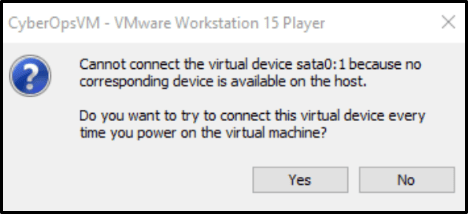

## Step - 10:

Make a clone of the git repository for the VM configuration.  Git is a tool used to manage collaborative software development projects.  We'll use it in this course for system setup and to allow your instructors to share code templates and other files with you.

Open a terminal window (by right-clicking on the desktop, and selecting *`Open in Terminal`*) and enter this command:

```Shell
cd
```
Then enter this command:

```Shell
git clone -b master --single-branch https://github.com/geozeke/ubuntu.git --depth 1
```

## Step - 11:

Close all other open programs in your VM, so that only your terminal window is running.  When ready, enter the following command in the terminal window (no spaces):

```Shell
./ubuntu/config/scripts/setup.py
```

If prompted for your password, please enter it.  It may take a while for the script to run, so please be patient.  When the script prompts you to do so, reboot your VM and log in.

## Step - 12:

Check to see if the connection to your Windows share worked properly by clicking on the file browser icon. If everything was successful, you should see your new *`shares`* drive on the bottom left side.  You can click on it to navigate to your shared folder, similar to the way you navigate your Windows machine using the file explorer.

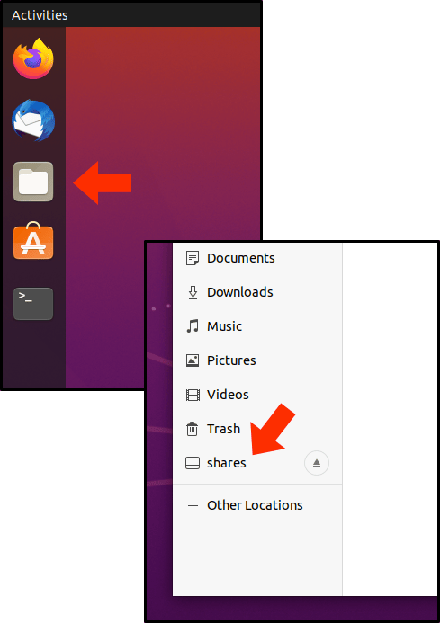

## Step - 13:

Click on the 3 x 3 grid of dots on the bottom left of your Ubuntu Desktop.  In the search box at the top of the window type *`software`*.  Look for the *`Software & Updates`* icon and click on it.

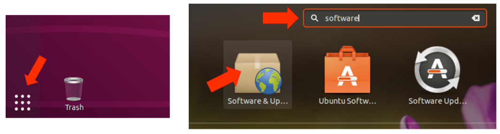

## Step - 14:

Select the *`Updates`* tab and ensure that *`Automatically check for updates:`* is set to *`Never`* and enter your password if requested.  When you're ready, click the *`Close`* button.

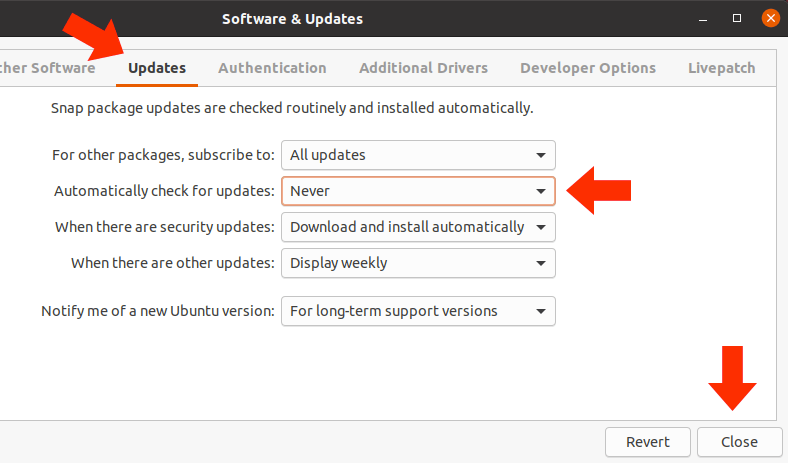

## Step - 15:

Click on the *`Settings`* icon.

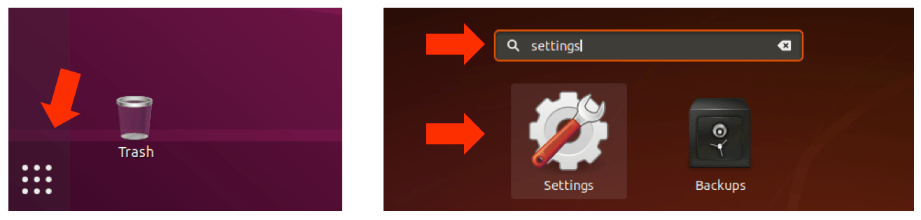

## Step - 16:

Click on the *`Power`* settings and set the *`Blank Screen`* option to *`Never`*.

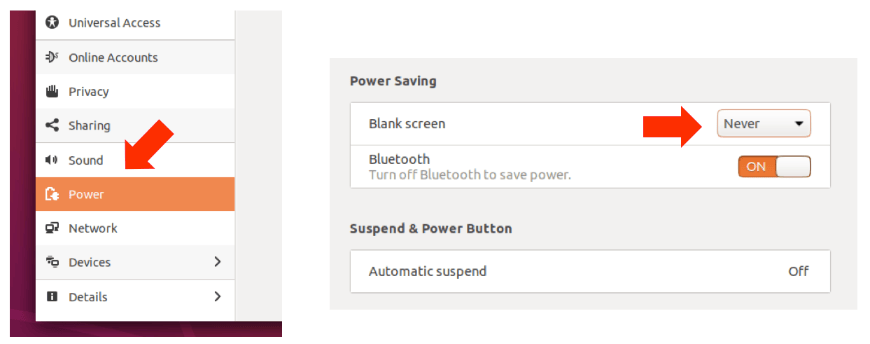

## Step - 17:

Click on the *`Privacy`* settings, then select *`Screen Lock`* and set the *`Automatic Screen Lock`* toggle to *`OFF`*.

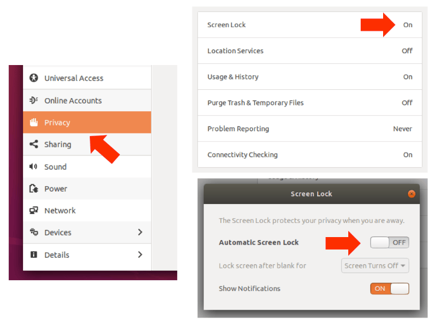

## Step - 18:

Your VM is ready to go!  You can now easily move content between your host (Windows) and VM (Ubuntu Linux) by moving files in and out of the shared folders.  To reinforce: both folders below will have the same content no matter which environment you’re in (replace *nardi* with your login name):

Ubuntu VM:

```Shell
/home/nardi/shares/Coursework
```

Windows:

```Shell
c:\Users\nardi\Documents\Coursework
```

Optional:

[Part-4: Setup Instructions for Public Key Encryption in Ubuntu Linux](vmguide-p4.md)
