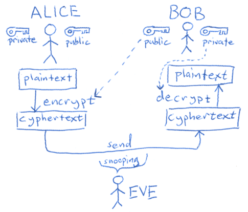
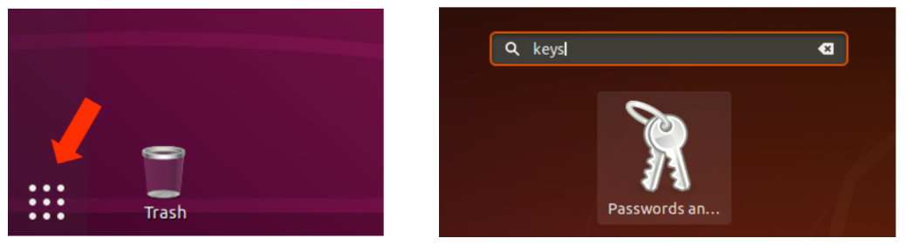
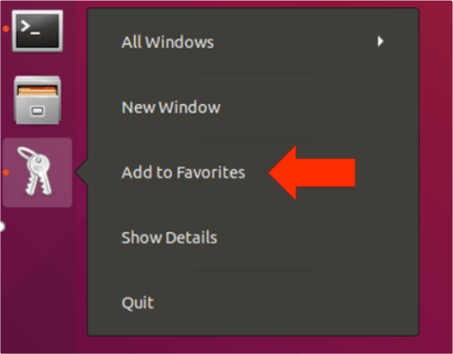
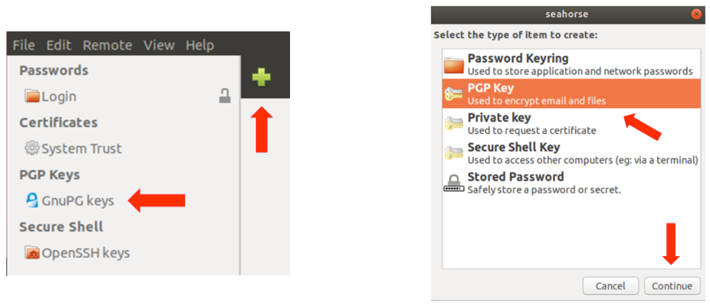
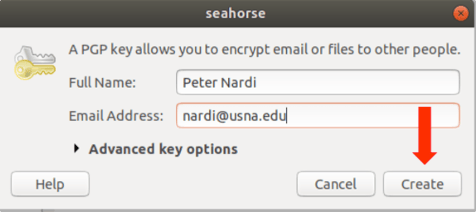
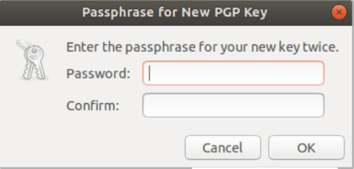
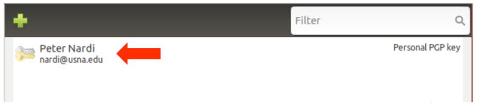
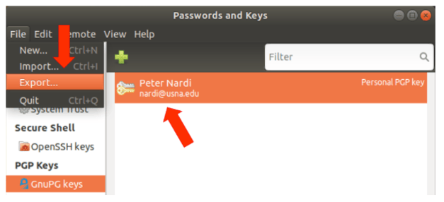
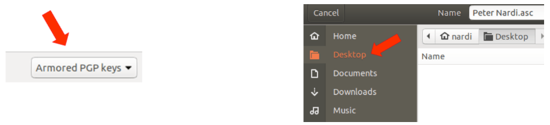
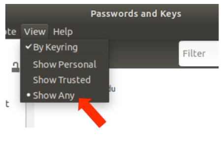

# Part-4: Setup Instructions for Public Key Encryption in Ubuntu Linux

Public Key encryption works by creating a set of mathematically related keys (long strings of characters) that permit encryption and decryption of files.  A file encrypted with a public key can only be decrypted with the associated private key.  In this way we can share our public keys with anyone without being concerned about compromise, as long as we always keep our private keys secure.

In this course, each of us will generate a key pair (public and private) and share our public keys.  We can then post encrypted files in a common shared folder and only the intended recipients will be able to decrypt the files and access the contents

## Step - 1:

If you have not completed Parts 1, 2 and 3 of the installation instructions, please do so before proceeding.

- [Part-1: Installing Workstation Player and Downloading the Ubuntu VM Image](vmguide-p1.md)
- [Part-2: Installation and Setup of The Ubuntu Virtual Machine](vmguide-p2.md)
- [Part-3: Setup Instructions for Folder Sharing and Repo Cloning](vmguide-p3.md)

## Step - 2:

Start by opening Ubuntu's key manager.  To get to it, click on the 3 x 3 grid of dots on the bottom left of your Ubuntu Desktop.  Then, in the search box at the top of the window type *`keys`*.  Look for the *`Passwords and Keys`* icon and click on it.

## Step - 3:

(OPTIONAL) Once the *`Passwords and Keys`* program starts, you can lock the icon to your application launcher to allow for quick access the next time you need it by right clicking on it and selecting *`Add to Favorites`*.

## Step - 4:

Click on the *`GnuPG keys`* item, then click on the green plus sign (+).  In the pop-up window select *`PGP Key`* and finally, click on *`Continue`*.

## Step - 5:

In the next window, enter your full name and USNA e-mail address.  There's no need to adjust the *`Advanced key options`*, but you can click on them to see what's there if you're curious; just don't change anything.  When you're ready, click *`Create`*

## Step - 6:

Enter the same password you used for your VM login and enter it again to confirm it.  When you're ready, click on *`OK`*.

## Step - 7:

Once your key pair is generated (it may take a little while) it will show up in your list of keys.

## Step - 8:

Next, click on your new key pair, then select *`Export…`* from the *`File`* menu.

## Step - 9:

Next, ensure *`Armored PGP keys`* is selected from the menu on the bottom right of the window and for convenience save your public key file (ending in *`.asc`*) to your Ubuntu Desktop.

## Step - 10:

As a final step, select the *`Show Any`* option from the *`View`* menu.  If you look at the menu item again after making this selection, you should see a little white dot, just to the left of *`Show Any`*.

## Step - 11:

You're all set!  Your instructor will guide you through posting your public keys and encrypting / decrypting files.
